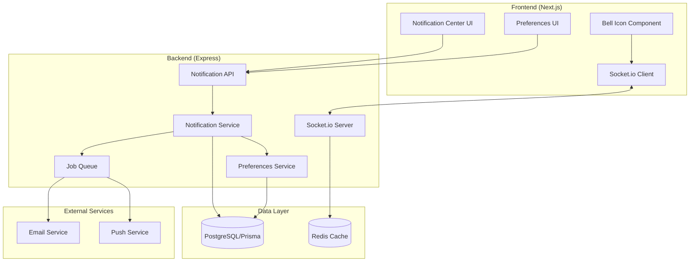

# Design Document: Notifications System

## Overview

The Notifications System is a multi-channel notification delivery platform that provides real-time and asynchronous notifications to MedThread users. The system consists of three primary layers:

1. **Backend Service Layer**: Handles notification creation, storage, preference management, and delivery orchestration
2. **Real-time Delivery Layer**: Uses Socket.io for instant notification delivery to connected clients
3. **Frontend Presentation Layer**: Provides UI components for viewing, managing, and configuring notifications

The system integrates with existing MedThread infrastructure including the authentication system, database (Prisma/PostgreSQL), and Socket.io chat service. It supports multiple delivery channels (in-app, email, browser push) with user-configurable preferences per notification type.

## Architecture

### High-Level Architecture



### Component Interaction Flow

**Notification Creation Flow:**
1. Event occurs (e.g., user replies to post)
2. Event handler calls Notification Service
3. Service checks recipient preferences
4. If enabled, creates notification record in database
5. Service enqueues delivery jobs (socket, email, push)
6. Socket job delivers to connected clients immediately
7. Email/push jobs process asynchronously

**Notification Retrieval Flow:**
1. User opens Notification Center
2. Frontend requests notifications via API
3. API queries database with filters (user_id, read_status, type)
4. Results returned with pagination
5. Frontend renders notification list
6. User interactions (mark read, delete) update via API

## Components and Interfaces

### Backend Components

#### Notification Service

Core service responsible for notification lifecycle management.

```typescript
interface NotificationService {
  // Create a notification for one or more recipients
  createNotification(params: CreateNotificationParams): Promise<Notification[]>;
  
  // Get notifications for a user with filtering and pagination
  getNotifications(userId: string, options: GetNotificationsOptions): Promise<PaginatedNotifications>;
  
  // Mark notification(s) as read
  markAsRead(notificationIds: string[], userId: string): Promise<void>;
  
  // Mark all notifications as read for a user
  markAllAsRead(userId: string): Promise<void>;
  
  // Delete notification (soft delete)
  deleteNotification(notificationId: string, userId: string): Promise<void>;
  
  // Get unread count for a user
  getUnreadCount(userId: string): Promise<number>;
  
  // Aggregate similar notifications
  aggregateNotifications(notifications: Notification[]): AggregatedNotification[];
}

interface CreateNotificationParams {
  type: NotificationType;
  recipientIds: string[];
  actorId: string;
  metadata: NotificationMetadata;
  contentId?: string;
  contentType?: 'POST' | 'COMMENT' | 'APPOINTMENT' | 'COMMUNITY';
}

interface GetNotificationsOptions {
  page?: number;
  limit?: number;
  type?: NotificationType;
  isRead?: boolean;
  startDate?: Date;
  endDate?: Date;
}

interface NotificationMetadata {
  title?: string;
  body?: string;
  preview?: string;
  link?: string;
  communityName?: string;
  postTitle?: string;
  [key: string]: any;
}
```

#### Preferences Service

Manages user notification preferences.

```typescript
interface PreferencesService {
  // Get user's notification preferences
  getPreferences(userId: string): Promise<NotificationPreferences>;
  
  // Update user's notification preferences
  updatePreferences(userId: string, preferences: Partial<NotificationPreferences>): Promise<NotificationPreferences>;
  
  // Check if notification type is enabled for user
  isNotificationEnabled(userId: string, type: NotificationType, channel: DeliveryChannel): Promise<boolean>;
  
  // Get default preferences for new users
  getDefaultPreferences(): NotificationPreferences;
  
  // Check if user is in quiet hours
  isInQuietHours(userId: string): Promise<boolean>;
}

interface NotificationPreferences {
  userId: string;
  inApp: Record<NotificationType, boolean>;
  email: Record<NotificationType, 'instant' | 'digest' | 'off'>;
  push: Record<NotificationType, boolean>;
  quietHoursStart?: string; // HH:mm format
  quietHoursEnd?: string;
  digestFrequency: 'daily' | 'weekly';
  upvoteThreshold?: number;
}
```

#### Socket Manager

Handles real-time notification delivery via Socket.io.

```typescript
interface SocketManager {
  // Send notification to connected user(s)
  sendNotification(userIds: string[], notification: Notification): Promise<void>;
  
  // Send unread count update
  sendUnreadCountUpdate(userId: string, count: number): Promise<void>;
  
  // Check if user is connected
  isUserConnected(userId: string): boolean;
  
  // Get connected user IDs
  getConnectedUsers(): string[];
}
```

#### Email Service Integration

Extends existing email service for notification delivery.

```typescript
interface NotificationEmailService {
  // Send instant notification email
  sendNotificationEmail(userId: string, notification: Notification): Promise<void>;
  
  // Send digest email with aggregated notifications
  sendDigestEmail(userId: string, notifications: Notification[], frequency: 'daily' | 'weekly'): Promise<void>;
  
  // Generate unsubscribe token
  generateUnsubscribeToken(userId: string, notificationType: NotificationType): string;
  
  // Handle unsubscribe request
  handleUnsubscribe(token: string): Promise<void>;
}
```

### Frontend Components

#### NotificationBell Component

Bell icon with unread count badge in navbar.

```typescript
interface NotificationBellProps {
  className?: string;
}

interface NotificationBellState {
  unreadCount: number;
  isOpen: boolean;
  recentNotifications: Notification[];
  loading: boolean;
}
```

**Features:**
- Displays unread count badge
- Opens dropdown with 10 most recent notifications
- Real-time updates via socket
- Click to navigate to full notification page
- Mark all as read action

#### NotificationCenter Component

Full-page notification management interface.

```typescript
interface NotificationCenterProps {
  initialNotifications?: Notification[];
}

interface NotificationCenterState {
  notifications: Notification[];
  filters: NotificationFilters;
  loading: boolean;
  hasMore: boolean;
  page: number;
}

interface NotificationFilters {
  type?: NotificationType;
  isRead?: boolean;
  dateRange?: { start: Date; end: Date };
}
```

**Features:**
- Paginated notification list
- Filter by type and read status
- Mark as read on click
- Delete individual notifications
- Mark all as read bulk action
- Infinite scroll or pagination

#### NotificationItem Component

Individual notification display component.

```typescript
interface NotificationItemProps {
  notification: Notification;
  onRead: (id: string) => void;
  onDelete: (id: string) => void;
  onClick: (notification: Notification) => void;
}
```

**Features:**
- Actor avatar and username
- Notification content with preview
- Relative timestamp
- Read/unread visual indicator
- Delete button
- Click to navigate to content

#### NotificationPreferences Component

User preferences management interface.

```typescript
interface NotificationPreferencesProps {
  userId: string;
}

interface NotificationPreferencesState {
  preferences: NotificationPreferences;
  loading: boolean;
  saving: boolean;
}
```

**Features:**
- Toggle controls for each notification type
- Channel selection (in-app, email, push)
- Email frequency selection (instant, digest, off)
- Quiet hours configuration
- Upvote threshold setting
- Save and reset actions

### API Endpoints

#### Notification Endpoints

```
GET    /api/notifications
GET    /api/notifications/unread-count
POST   /api/notifications/:id/read
POST   /api/notifications/mark-all-read
DELETE /api/notifications/:id
GET    /api/notifications/preferences
PUT    /api/notifications/preferences
POST   /api/notifications/unsubscribe/:token
```

**GET /api/notifications**
- Query params: page, limit, type, isRead, startDate, endDate
- Returns: { notifications: Notification[], total: number, hasMore: boolean }
- Auth: Required

**GET /api/notifications/unread-count**
- Returns: { count: number }
- Auth: Required

**POST /api/notifications/:id/read**
- Body: none
- Returns: { success: boolean }
- Auth: Required

**POST /api/notifications/mark-all-read**
- Body: none
- Returns: { success: boolean, count: number }
- Auth: Required

**DELETE /api/notifications/:id**
- Returns: { success: boolean }
- Auth: Required

**GET /api/notifications/preferences**
- Returns: NotificationPreferences
- Auth: Required

**PUT /api/notifications/preferences**
- Body: Partial<NotificationPreferences>
- Returns: NotificationPreferences
- Auth: Required

**POST /api/notifications/unsubscribe/:token**
- Body: none
- Returns: { success: boolean, type: NotificationType }
- Auth: Not required (token-based)

### Socket Events

#### Client → Server

```typescript
// Join user's notification room
socket.emit('notification:join', { userId: string });

// Leave notification room
socket.emit('notification:leave');

// Mark notification as read
socket.emit('notification:read', { notificationId: string });
```

#### Server → Client

```typescript
// New notification received
socket.on('notification:new', (notification: Notification) => {});

// Unread count updated
socket.on('notification:unread-count', (count: number) => {});

// Notification marked as read (sync across tabs)
socket.on('notification:read', (notificationId: string) => {});

// All notifications marked as read
socket.on('notification:all-read', () => {});
```

## Data Models

### Notification Model

```prisma
model Notification {
  id            String           @id @default(cuid())
  type          NotificationType
  recipientId   String
  recipient     User             @relation("NotificationRecipient", fields: [recipientId], references: [id])
  actorId       String
  actor         User             @relation("NotificationActor", fields: [actorId], references: [id])
  contentId     String?
  contentType   ContentType?
  metadata      Json
  isRead        Boolean          @default(false)
  readAt        DateTime?
  isDeleted     Boolean          @default(false)
  deletedAt     DateTime?
  createdAt     DateTime         @default(now())
  updatedAt     DateTime         @updatedAt
  
  @@index([recipientId, isRead, createdAt])
  @@index([recipientId, type])
  @@index([recipientId, isDeleted])
  @@map("notifications")
}

enum NotificationType {
  REPLY
  MENTION
  AWARD
  FOLLOWER
  APPOINTMENT_REQUEST
  APPOINTMENT_UPDATE
  VERIFICATION_STATUS
  COMMUNITY_INVITE
  DIRECT_MESSAGE
  SYSTEM_ANNOUNCEMENT
  UPVOTE_MILESTONE
}

enum ContentType {
  POST
  COMMENT
  APPOINTMENT
  COMMUNITY
}
```

### NotificationPreferences Model

```prisma
model NotificationPreferences {
  id                String   @id @default(cuid())
  userId            String   @unique
  user              User     @relation(fields: [userId], references: [id])
  inApp             Json     // Record<NotificationType, boolean>
  email             Json     // Record<NotificationType, 'instant' | 'digest' | 'off'>
  push              Json     // Record<NotificationType, boolean>
  quietHoursStart   String?  // HH:mm format
  quietHoursEnd     String?  // HH:mm format
  digestFrequency   String   @default("daily") // 'daily' | 'weekly'
  upvoteThreshold   Int?
  createdAt         DateTime @default(now())
  updatedAt         DateTime @updatedAt
  
  @@map("notification_preferences")
}
```

### EmailQueue Model

```prisma
model EmailQueue {
  id              String   @id @default(cuid())
  userId          String
  user            User     @relation(fields: [userId], references: [id])
  notificationId  String
  notification    Notification @relation(fields: [notificationId], references: [id])
  type            String   // 'instant' | 'digest'
  status          String   @default("pending") // 'pending' | 'sent' | 'failed'
  attempts        Int      @default(0)
  lastAttemptAt   DateTime?
  sentAt          DateTime?
  error           String?
  createdAt       DateTime @default(now())
  updatedAt       DateTime @updatedAt
  
  @@index([status, createdAt])
  @@index([userId, type])
  @@map("email_queue")
}
```

## Implementation Details

### Notification Creation Logic

```typescript
async function createNotification(params: CreateNotificationParams): Promise<Notification[]> {
  const { type, recipientIds, actorId, metadata, contentId, contentType } = params;
  
  // 1. Filter recipients based on preferences
  const eligibleRecipients = await filterRecipientsByPreferences(recipientIds, type);
  
  // 2. Check for blocked users
  const unblocked = await filterBlockedUsers(eligibleRecipients, actorId);
  
  // 3. Check quiet hours for each recipient
  const activeRecipients = await filterQuietHours(unblocked);
  
  // 4. Create notification records
  const notifications = await prisma.notification.createMany({
    data: activeRecipients.map(recipientId => ({
      type,
      recipientId,
      actorId,
      contentId,
      contentType,
      metadata,
    })),
  });
  
  // 5. Enqueue delivery jobs
  await enqueueSocketDelivery(notifications);
  await enqueueEmailDelivery(notifications);
  await enqueuePushDelivery(notifications);
  
  return notifications;
}
```

### Notification Aggregation Logic

```typescript
function aggregateNotifications(notifications: Notification[]): AggregatedNotification[] {
  const grouped = new Map<string, Notification[]>();
  
  // Group by type + contentId + time window (1 hour)
  for (const notification of notifications) {
    const key = `${notification.type}-${notification.contentId}-${getHourBucket(notification.createdAt)}`;
    if (!grouped.has(key)) {
      grouped.set(key, []);
    }
    grouped.get(key)!.push(notification);
  }
  
  // Aggregate each group
  return Array.from(grouped.values()).map(group => {
    if (group.length === 1) {
      return { ...group[0], aggregatedCount: 1 };
    }
    
    const actors = group.map(n => n.actor).slice(0, 50);
    const count = group.length;
    
    return {
      ...group[0],
      actors,
      aggregatedCount: count,
      metadata: {
        ...group[0].metadata,
        actorCount: count,
        actorNames: actors.map(a => a.username),
      },
    };
  });
}
```

### Real-time Delivery

```typescript
// Socket.io integration
io.on('connection', (socket) => {
  socket.on('notification:join', async ({ userId }) => {
    // Authenticate socket
    const user = await authenticateSocket(socket);
    if (user.id !== userId) return;
    
    // Join user's notification room
    socket.join(`notifications:${userId}`);
    
    // Send current unread count
    const count = await notificationService.getUnreadCount(userId);
    socket.emit('notification:unread-count', count);
  });
});

// Deliver notification via socket
async function deliverViaSocket(notification: Notification) {
  io.to(`notifications:${notification.recipientId}`).emit('notification:new', notification);
  
  const count = await notificationService.getUnreadCount(notification.recipientId);
  io.to(`notifications:${notification.recipientId}`).emit('notification:unread-count', count);
}
```

### Email Delivery

```typescript
// Instant email delivery
async function sendInstantEmail(notification: Notification) {
  const user = await prisma.user.findUnique({ where: { id: notification.recipientId } });
  const preferences = await preferencesService.getPreferences(user.id);
  
  if (preferences.email[notification.type] !== 'instant') return;
  
  const template = getEmailTemplate(notification.type);
  const unsubscribeToken = generateUnsubscribeToken(user.id, notification.type);
  
  await emailService.send({
    to: user.email,
    subject: template.subject(notification),
    html: template.html(notification, unsubscribeToken),
  });
}

// Digest email delivery (cron job)
async function sendDigestEmails(frequency: 'daily' | 'weekly') {
  const users = await prisma.user.findMany({
    where: {
      notificationPreferences: {
        digestFrequency: frequency,
      },
    },
  });
  
  for (const user of users) {
    const since = frequency === 'daily' ? subDays(new Date(), 1) : subWeeks(new Date(), 1);
    const notifications = await notificationService.getNotifications(user.id, {
      startDate: since,
      isRead: false,
    });
    
    if (notifications.notifications.length === 0) continue;
    
    await emailService.sendDigestEmail(user.id, notifications.notifications, frequency);
  }
}
```

### Browser Push Notifications

```typescript
// Request permission and subscribe
async function subscribeToPushNotifications() {
  const permission = await Notification.requestPermission();
  if (permission !== 'granted') return;
  
  const registration = await navigator.serviceWorker.ready;
  const subscription = await registration.pushManager.subscribe({
    userVisibleOnly: true,
    applicationServerKey: VAPID_PUBLIC_KEY,
  });
  
  // Send subscription to backend
  await fetch('/api/notifications/push/subscribe', {
    method: 'POST',
    body: JSON.stringify(subscription),
  });
}

// Backend: Send push notification
async function sendPushNotification(notification: Notification) {
  const subscriptions = await prisma.pushSubscription.findMany({
    where: { userId: notification.recipientId },
  });
  
  for (const subscription of subscriptions) {
    await webpush.sendNotification(subscription.data, JSON.stringify({
      title: formatNotificationTitle(notification),
      body: formatNotificationBody(notification),
      icon: notification.actor.avatar,
      data: {
        url: notification.metadata.link,
        notificationId: notification.id,
      },
    }));
  }
}
```

## Security Considerations

1. **Authentication**: All API endpoints require valid JWT authentication
2. **Authorization**: Users can only access their own notifications
3. **Input Validation**: All user inputs sanitized to prevent XSS
4. **Rate Limiting**: API endpoints rate-limited to prevent abuse
5. **Socket Authentication**: Socket connections require valid JWT
6. **Unsubscribe Tokens**: Time-limited, signed tokens for email unsubscribe
7. **Content Sanitization**: Notification content sanitized before storage and display
8. **Blocked Users**: Notifications not created from blocked users
9. **Permission Checks**: Verify user has access to content before creating notification

## Performance Optimizations

1. **Database Indexes**: Composite indexes on recipientId + isRead + createdAt
2. **Caching**: Redis cache for unread counts and recent notifications
3. **Batch Processing**: Bulk notification creation for multiple recipients
4. **Async Jobs**: Email and push delivery via job queue
5. **Pagination**: Limit query results to prevent large data transfers
6. **Socket Rooms**: Efficient targeting of connected users
7. **Aggregation**: Reduce notification volume by grouping similar events
8. **Lazy Loading**: Load notification details on-demand
9. **Connection Pooling**: Reuse database connections
10. **CDN**: Serve static assets (avatars, icons) via CDN

## Testing Strategy

1. **Unit Tests**: Test individual service methods
2. **Integration Tests**: Test API endpoints and database interactions
3. **Socket Tests**: Test real-time delivery and synchronization
4. **E2E Tests**: Test complete notification flows from creation to display
5. **Load Tests**: Verify system handles high notification volumes
6. **Email Tests**: Verify email formatting and delivery
7. **Preference Tests**: Verify preference filtering works correctly
8. **Aggregation Tests**: Verify notification grouping logic
9. **Security Tests**: Verify authorization and input validation
10. **Browser Tests**: Test push notifications across browsers

## Monitoring and Observability

1. **Metrics**:
   - Notification creation rate
   - Delivery success rate per channel
   - Average delivery latency
   - Unread notification count distribution
   - API endpoint response times
   - Socket connection count

2. **Logging**:
   - Notification creation events
   - Delivery failures with retry attempts
   - Preference updates
   - API errors and exceptions
   - Socket connection/disconnection events

3. **Alerts**:
   - Email delivery failure rate > 5%
   - Socket delivery latency > 5 seconds
   - Database query time > 1 second
   - Unread count > 1000 for any user
   - Job queue backlog > 10,000

## Migration Strategy

1. **Phase 1**: Deploy database schema and migrations
2. **Phase 2**: Deploy backend services without triggering notifications
3. **Phase 3**: Enable notification creation for low-volume events (follows, awards)
4. **Phase 4**: Deploy frontend components with feature flag
5. **Phase 5**: Enable notification creation for high-volume events (replies, mentions)
6. **Phase 6**: Enable email and push delivery
7. **Phase 7**: Remove feature flags and announce to users

## Future Enhancements

1. **Rich Notifications**: Support images, videos, and interactive elements
2. **Notification Channels**: Allow users to create custom notification channels
3. **Smart Filtering**: ML-based notification prioritization
4. **Notification Scheduling**: Allow users to schedule notification delivery times
5. **Multi-language Support**: Localized notification content
6. **Notification Templates**: User-customizable notification formats
7. **Analytics Dashboard**: User-facing notification analytics
8. **Notification Forwarding**: Forward notifications to external services (Slack, Discord)
9. **Voice Notifications**: Text-to-speech for accessibility
10. **Notification Snoozing**: Temporarily hide notifications

