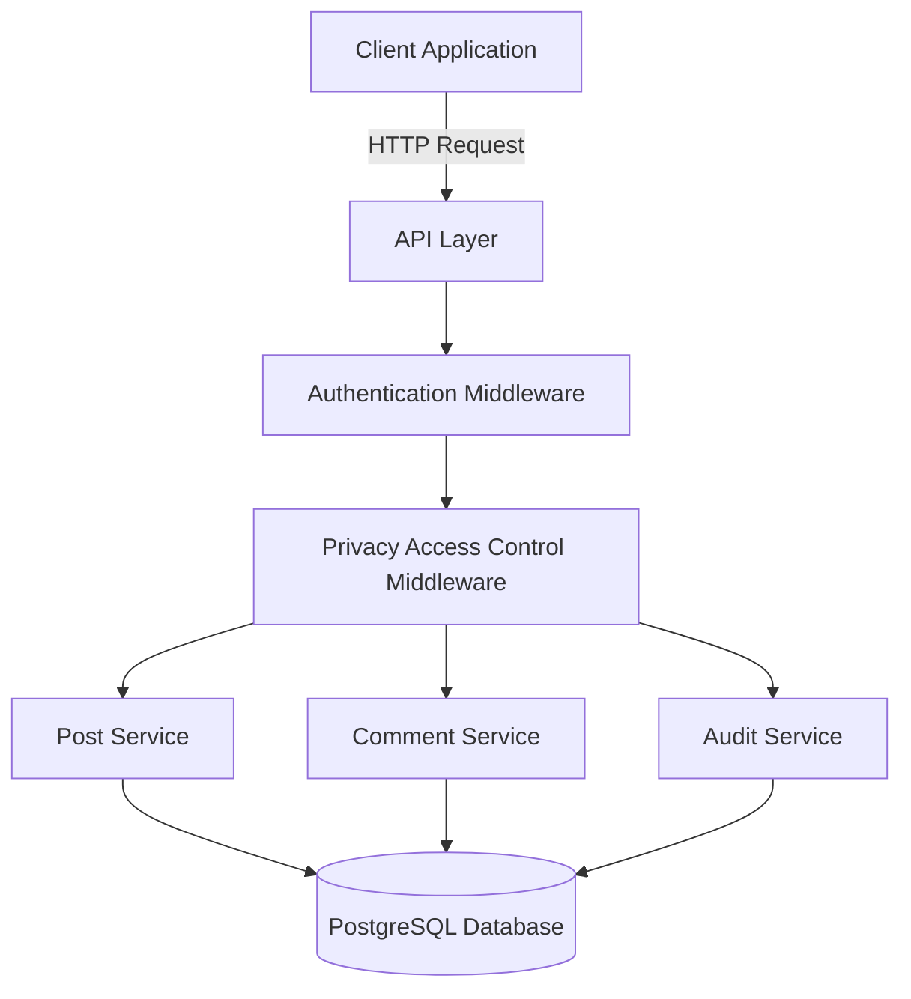
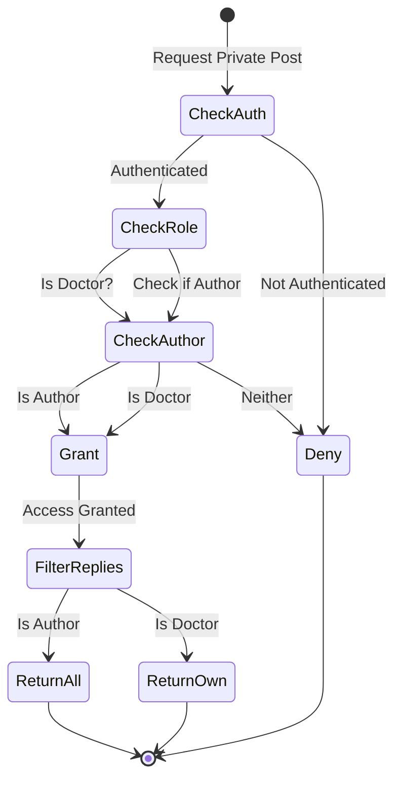

# Design Document: Public vs Private Posts

## Overview

This feature extends the existing post system to support two privacy modes: PUBLIC and PRIVATE. Public posts maintain current behavior (visible to all users with all replies visible). Private posts introduce a new confidential consultation mode where only doctors can see the post, and each doctor's reply is isolated from other doctors' replies. The post author always sees all replies to their own post.

The design leverages the existing Post and Comment models in Prisma, adding two boolean fields: `isPrivate` on Post and `isPrivateReply` on Comment. Access control is enforced at the API middleware level, with filtering logic in the database queries to ensure reply isolation for private posts.

## Architecture

### High-Level Architecture



### Privacy Access Control Flow



## Components and Interfaces

### 1. Database Schema Extensions

**Post Model Extension:**
```typescript
model Post {
  // ... existing fields ...
  isPrivate        Boolean         @default(false)
  // ... rest of model ...
}
```

**Comment Model Extension:**
```typescript
model Comment {
  // ... existing fields ...
  isPrivateReply   Boolean         @default(false)
  // ... rest of model ...
}
```

**Migration Requirements:**
- Add `isPrivate` column to Post table with default false
- Add `isPrivateReply` column to Comment table with default false
- Add index on `isPrivate` for efficient filtering
- Backfill existing posts with `isPrivate = false`
- Backfill existing comments with `isPrivateReply = false`

### 2. Privacy Access Control Middleware

**Interface:**
```typescript
interface PrivacyCheckResult {
  hasAccess: boolean;
  isAuthor: boolean;
  isDoctor: boolean;
  shouldFilterReplies: boolean;
}

function checkPrivatePostAccess(
  userId: string,
  userRole: UserRole,
  post: Post
): PrivacyCheckResult;
```

**Logic:**
- If post is public: grant access to all users
- If post is private:
  - Grant access if user is post author
  - Grant access if user is doctor with APPROVED status
  - Deny access otherwise
- Set `shouldFilterReplies = true` if user is doctor but not author
- Set `shouldFilterReplies = false` if user is author

### 3. Post Service

**Interface:**
```typescript
interface CreatePostInput {
  title: string;
  content?: string;
  communityId: string;
  isPrivate?: boolean;
  tags?: string[];
  mediaUrls?: string[];
}

interface GetPostsFilter {
  communityId?: string;
  userId?: string;
  privacyMode?: 'PUBLIC' | 'PRIVATE' | 'ALL';
  includePrivate: boolean;
  requestingUserId?: string;
  requestingUserRole?: UserRole;
}

async function createPost(input: CreatePostInput, authorId: string): Promise<Post>;
async function getPosts(filter: GetPostsFilter, pagination: PaginationParams): Promise<PaginatedResponse<Post>>;
async function getPostById(postId: string, userId?: string, userRole?: UserRole): Promise<Post | null>;
async function updatePost(postId: string, updates: Partial<Post>): Promise<Post>;
```

**Business Rules:**
- Default `isPrivate` to false if not specified
- Validate `isPrivate` is boolean
- Reject updates that attempt to change `isPrivate` field
- Filter posts based on user role and privacy mode
- Include audit logging for private post access

### 4. Comment Service

**Interface:**
```typescript
interface CreateCommentInput {
  content: string;
  postId: string;
  parentId?: string;
}

interface GetCommentsFilter {
  postId: string;
  requestingUserId?: string;
  requestingUserRole?: UserRole;
  isPostPrivate: boolean;
  postAuthorId: string;
}

async function createComment(input: CreateCommentInput, authorId: string): Promise<Comment>;
async function getComments(filter: GetCommentsFilter, pagination: PaginationParams): Promise<PaginatedResponse<Comment>>;
```

**Business Rules:**
- Automatically set `isPrivateReply = true` if parent post is private
- Filter comments based on privacy rules:
  - If post is public: return all comments
  - If post is private and user is author: return all comments
  - If post is private and user is doctor: return only that doctor's comments
- Include audit logging for private comment access

### 5. Privacy Filter Utility

**Interface:**
```typescript
function buildPrivatePostWhereClause(
  userId: string | undefined,
  userRole: UserRole | undefined,
  privacyFilter?: 'PUBLIC' | 'PRIVATE' | 'ALL'
): Prisma.PostWhereInput;

function buildPrivateCommentWhereClause(
  post: Post,
  userId: string | undefined,
  userRole: UserRole | undefined
): Prisma.CommentWhereInput;
```

**Logic:**
- For posts:
  - If user is not authenticated: `{ isPrivate: false }`
  - If user is not doctor: `{ isPrivate: false }`
  - If user is doctor and filter is 'PUBLIC': `{ isPrivate: false }`
  - If user is doctor and filter is 'PRIVATE': `{ isPrivate: true }`
  - If user is doctor and filter is 'ALL': `{}` (no privacy filter)
  - Always include: `{ OR: [{ isPrivate: false }, { authorId: userId }] }` to show user's own posts

- For comments:
  - If post is public: return all comments
  - If post is private and user is author: return all comments
  - If post is private and user is doctor: `{ OR: [{ authorId: userId }] }`

## Data Models

### Post Model (Extended)

```typescript
interface Post {
  id: string;
  type: PostType;
  title: string;
  content?: string;
  url?: string;
  mediaUrls: string[];
  thumbnailUrl?: string;
  authorId: string;
  communityId: string;
  flairId?: string;
  upvotes: number;
  downvotes: number;
  score: number;
  commentCount: number;
  isNSFW: boolean;
  isSpoiler: boolean;
  isPinned: boolean;
  isLocked: boolean;
  isArchived: boolean;
  isRemoved: boolean;
  isDraft: boolean;
  isPrivate: boolean;  // NEW FIELD
  commentsDisabled: boolean;
  contestMode: boolean;
  createdAt: Date;
  updatedAt: Date;
  editedAt?: Date;
  publishedAt?: Date;
}
```

### Comment Model (Extended)

```typescript
interface Comment {
  id: string;
  content: string;
  authorId: string;
  postId: string;
  parentId?: string;
  upvotes: number;
  downvotes: number;
  score: number;
  depth: number;
  isStickied: boolean;
  isDistinguished: boolean;
  isRemoved: boolean;
  isLocked: boolean;
  isPrivateReply: boolean;  // NEW FIELD
  createdAt: Date;
  updatedAt: Date;
  editedAt?: Date;
}
```

### Privacy Access Result

```typescript
interface PrivacyAccessResult {
  hasAccess: boolean;
  isAuthor: boolean;
  isDoctor: boolean;
  shouldFilterReplies: boolean;
  reason?: string;  // For audit logging
}
```

## Correctness Properties

*A property is a characteristic or behavior that should hold true across all valid executions of a system—essentially, a formal statement about what the system should do. Properties serve as the bridge between human-readable specifications and machine-verifiable correctness guarantees.*


### Property Reflection

After analyzing all acceptance criteria, I've identified the following redundancies:

**Redundant Properties:**
- 2.4 is redundant with 2.2 and 2.3 (if all replies visible, then multiple doctor replies visible)
- 4.4 and 4.5 are redundant with 4.2 (all express reply isolation)
- 5.1 is redundant with 3.1 and 3.2 (access control already covered)
- 5.3 is redundant with 4.2 (reply filtering already covered)
- 5.4 is redundant with 4.3 (author sees all already covered)
- 7.5 is redundant with 3.5 (non-doctors see only public posts)
- 8.1 is redundant with 1.2 (default value testing)
- 8.3 is redundant with 4.1 (auto-set isPrivateReply)
- 9.1, 9.2, 9.3, 9.4, 9.5 are all redundant with earlier properties (API endpoints implement the same logic)
- 13.1, 13.2, 13.3, 13.4 are all redundant with 1.4 (immutability)
- 15.2 is redundant with 10.5 (caching prevention)
- 15.5 is redundant with 3.1, 3.2, 3.3 (access control)

**Combined Properties:**
- 3.1 and 3.2 can be combined into one property about private post access
- 2.2 and 2.3 can be combined into one property about public post reply visibility

**Final Property Set:**
After eliminating redundancy, we have 20 unique testable properties covering:
- Privacy mode defaults and validation (2 properties)
- Privacy mode immutability (1 property)
- Public post visibility (2 properties)
- Private post access control (2 properties)
- Reply isolation for private posts (2 properties)
- Privacy filtering (3 properties)
- Comment privacy inheritance (2 properties)
- Statistics and SEO exclusion (3 properties)
- Email notifications (4 properties)
- Audit logging (4 properties)
- Security headers (1 property)
- Private post counts (1 property)

### Core Properties

**Property 1: Privacy mode defaults to public**
*For any* post creation request that does not specify isPrivate, the created post should have isPrivate set to false.
**Validates: Requirements 1.2**

**Property 2: Privacy mode persistence**
*For any* post creation request with a specified isPrivate value, retrieving the post should return the same isPrivate value.
**Validates: Requirements 1.3**

**Property 3: Privacy mode immutability**
*For any* existing post, attempting to update the isPrivate field should be rejected with an error.
**Validates: Requirements 1.4, 13.1, 13.2, 13.3, 13.4**

**Property 4: Privacy mode validation**
*For any* post creation or update request, the isPrivate field should only accept boolean values (true or false).
**Validates: Requirements 1.5**

**Property 5: Public posts visible to all users**
*For any* public post and any user role (including unauthenticated), the post should be accessible and visible.
**Validates: Requirements 2.1**

**Property 6: Public post replies visible to all**
*For any* public post and any user, retrieving comments should return all comments without filtering based on user role.
**Validates: Requirements 2.2, 2.3, 2.4**

**Property 7: Public posts in main feed**
*For any* user querying the main posts feed, all public posts should be included in the results.
**Validates: Requirements 2.5**

**Property 8: Private post access control**
*For any* private post, access should be granted if and only if the requesting user is either (a) the post author, or (b) a doctor with APPROVED verification status.
**Validates: Requirements 3.1, 3.2, 5.1**

**Property 9: Non-doctor private post denial**
*For any* private post and any non-doctor user who is not the post author, access attempts should be denied with an error response.
**Validates: Requirements 3.3**

**Property 10: Doctor private posts list**
*For any* doctor with APPROVED status, querying posts with privacy filter set to PRIVATE should return all private posts.
**Validates: Requirements 3.4**

**Property 11: Private posts excluded from non-doctor feeds**
*For any* non-doctor user querying the main posts feed, private posts should be excluded from results (except posts authored by that user).
**Validates: Requirements 3.5, 7.5**

**Property 12: Private reply auto-marking**
*For any* comment created on a private post, the comment should automatically have isPrivateReply set to true.
**Validates: Requirements 4.1, 8.3**

**Property 13: Reply isolation for doctors**
*For any* private post with multiple doctor replies, when a doctor retrieves comments, they should only see their own replies and not other doctors' replies.
**Validates: Requirements 4.2, 4.4, 4.5, 5.3**

**Property 14: Author sees all replies**
*For any* private post, when the post author retrieves comments, all comments from all doctors should be returned without filtering.
**Validates: Requirements 4.3, 5.4**

**Property 15: Public filter returns only public posts**
*For any* doctor querying posts with privacy filter set to PUBLIC, only posts with isPrivate = false should be returned.
**Validates: Requirements 7.2**

**Property 16: Private filter returns only private posts**
*For any* doctor querying posts with privacy filter set to PRIVATE, only posts with isPrivate = true should be returned.
**Validates: Requirements 7.3**

**Property 17: All filter returns both privacy modes**
*For any* doctor querying posts with privacy filter set to ALL, both public and private posts should be returned.
**Validates: Requirements 7.4**

**Property 18: Non-doctor private list empty**
*For any* non-doctor user querying posts with privacy filter set to PRIVATE, the result should be empty or return an access denied error.
**Validates: Requirements 5.2**

**Property 19: Public comment default**
*For any* comment created on a public post, the comment should have isPrivateReply set to false.
**Validates: Requirements 8.2, 8.4**

**Property 20: Private posts excluded from karma**
*For any* user's karma calculation, private posts and private replies should not contribute to the total karma score.
**Validates: Requirements 10.1**

**Property 21: Private replies excluded from public statistics**
*For any* public statistics calculation (e.g., total comments, trending posts), private replies should be excluded from counts.
**Validates: Requirements 10.2**

**Property 22: Private posts excluded from sitemap**
*For any* sitemap generation, private posts should not appear in the sitemap output.
**Validates: Requirements 10.3**

**Property 23: Private posts have noindex meta tags**
*For any* private post page response, the HTML should include noindex and nofollow meta tags.
**Validates: Requirements 10.4**

**Property 24: Private posts not cached**
*For any* private post response, the HTTP headers should include cache-control directives that prevent caching.
**Validates: Requirements 10.5, 15.2**

**Property 25: Private post email notifications indicate privacy**
*For any* email notification about a private post, the email content should include a privacy indicator or label.
**Validates: Requirements 11.1**

**Property 26: Private reply email notifications indicate privacy**
*For any* email notification about a private reply, the email content should indicate the reply is private.
**Validates: Requirements 11.2**

**Property 27: Doctor notification explains isolation**
*For any* email notification to a doctor about a private post, the email should include a note explaining that other doctors cannot see their reply.
**Validates: Requirements 11.3**

**Property 28: Author notification identifies doctor**
*For any* email notification to a post author about a private reply, the email should include the replying doctor's username or identifier.
**Validates: Requirements 11.4**

**Property 29: Private post access logged**
*For any* successful access to a private post, an audit log entry should be created with userId, postId, and timestamp.
**Validates: Requirements 12.1**

**Property 30: Private reply access logged**
*For any* retrieval of private replies by a doctor, an audit log entry should be created recording the access.
**Validates: Requirements 12.2**

**Property 31: Private post creation logged**
*For any* private post creation, an audit log entry should be created recording the event.
**Validates: Requirements 12.3**

**Property 32: Private post denial logged**
*For any* denied access attempt to a private post, an audit log entry should be created with the user ID and post ID.
**Validates: Requirements 12.4**

**Property 33: Private post count visible to doctors**
*For any* doctor querying the posts list, the response should include the total count of private posts.
**Validates: Requirements 14.1**

**Property 34: Private post list hides content**
*For any* private post in a list view response, the full content should not be included (only metadata like title, author, timestamp).
**Validates: Requirements 14.2**

**Property 35: Private post responses include security headers**
*For any* private post response, security headers (X-Content-Type-Options, X-Frame-Options, etc.) should be included to prevent content leakage.
**Validates: Requirements 15.4**

## Error Handling

### Access Denied Errors

**Scenario:** Non-doctor user attempts to access private post
- HTTP Status: 403 Forbidden
- Response: `{ success: false, error: 'Access denied: This post is private' }`
- Audit log: Record denied access attempt

**Scenario:** Unauthenticated user attempts to access private post
- HTTP Status: 401 Unauthorized
- Response: `{ success: false, error: 'Authentication required' }`
- No audit log (no user to log)

### Validation Errors

**Scenario:** Attempt to update post privacy mode
- HTTP Status: 400 Bad Request
- Response: `{ success: false, error: 'Privacy mode cannot be changed after post creation' }`
- Audit log: Record attempted privacy mode change

**Scenario:** Invalid privacy mode value
- HTTP Status: 400 Bad Request
- Response: `{ success: false, error: 'Invalid privacy mode: must be boolean' }`

### Not Found Errors

**Scenario:** Private post not found (or access denied)
- HTTP Status: 404 Not Found
- Response: `{ success: false, error: 'Post not found' }`
- Note: Use 404 instead of 403 to avoid leaking information about private post existence

## Testing Strategy

### Dual Testing Approach

This feature requires both unit tests and property-based tests:

**Unit Tests** focus on:
- Specific examples of public and private post creation
- Edge cases (empty privacy mode, invalid values)
- Error conditions (access denied, not found)
- Integration between components (middleware → service → database)
- UI component rendering with privacy indicators

**Property-Based Tests** focus on:
- Universal properties across all posts and users
- Access control rules for all combinations of user roles and post privacy
- Reply isolation across all possible doctor combinations
- Privacy filtering across all filter combinations
- Audit logging for all access patterns

### Property-Based Testing Configuration

**Library:** fast-check (for TypeScript/JavaScript)
**Configuration:**
- Minimum 100 iterations per property test
- Each test must reference its design document property
- Tag format: **Feature: public-private-posts, Property {number}: {property_text}**

**Test Organization:**
- Group tests by component (Post Service, Comment Service, Access Control)
- Each correctness property implemented by a single property-based test
- Property tests run alongside unit tests in CI/CD pipeline

### Test Data Generation

**Generators needed:**
- Random users with different roles (PATIENT, DOCTOR, ADMIN, etc.)
- Random doctors with different verification statuses (PENDING, APPROVED, REJECTED)
- Random posts with different privacy modes
- Random comments on posts
- Random access patterns (user + post combinations)

### Coverage Requirements

- All 35 correctness properties must have corresponding property-based tests
- Unit tests should cover at least 80% of code paths
- Integration tests should verify end-to-end flows for both public and private posts
- Security tests should verify access control cannot be bypassed

### Testing Priorities

**Critical (must pass before deployment):**
- Property 8: Private post access control
- Property 13: Reply isolation for doctors
- Property 3: Privacy mode immutability
- Property 9: Non-doctor private post denial

**High priority:**
- All access control properties (5, 8, 9, 11, 18)
- All reply isolation properties (13, 14)
- All audit logging properties (29, 30, 31, 32)

**Medium priority:**
- Privacy filtering properties (15, 16, 17)
- Statistics and SEO properties (20, 21, 22, 23, 24)
- Email notification properties (25, 26, 27, 28)

**Lower priority:**
- UI rendering examples (6.1, 6.2, 6.4, 6.5)
- Count visibility properties (33, 34)

## Implementation Notes

### Migration Strategy

1. Add database columns with default values (no downtime)
2. Deploy API changes with backward compatibility
3. Deploy frontend changes with feature flag
4. Enable feature flag after validation
5. Monitor audit logs for access patterns

### Performance Considerations

- Index `isPrivate` field for efficient filtering
- Consider materialized views for private post counts
- Cache public post queries (but never private posts)
- Use database-level filtering to minimize data transfer

### Security Considerations

- Never cache private post content
- Always use HTTPS for private post requests
- Include security headers on all private post responses
- Audit log all private post access
- Use 404 instead of 403 to avoid information leakage
- Validate user role and verification status on every request

### Backward Compatibility

- Existing posts default to public (isPrivate = false)
- Existing comments default to non-private replies (isPrivateReply = false)
- Public post behavior unchanged
- No breaking changes to existing API contracts
